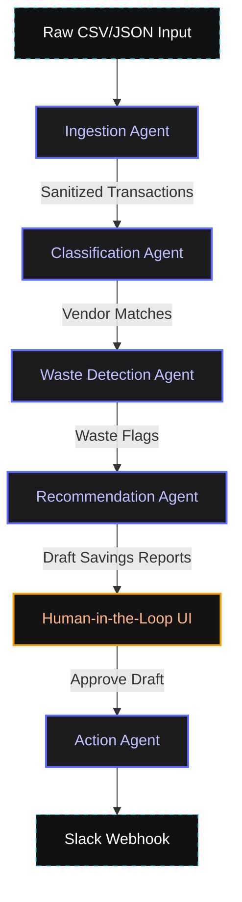

<div align="center">
  <h1>🛡️ Spend Guardian</h1>
  <p><strong>Agents for Business Hackathon Submission (Kaggle x Google)</strong></p>
  
  [](https://www.python.org/)
  [](https://github.com/google/adk)
  [](https://groq.com/)
  [](https://reactjs.org/)
  []()
  [](https://opensource.org/licenses/MIT)

  
  
  *Detect SaaS waste, identify overlap, and reclaim budget—all with a strict Human-in-the-Loop AI pipeline.*
</div>

---

## 🏆 Hackathon Links
- [**Kaggle Writeup**](#) *(Placeholder link)*
- [**Demo Video (YouTube)**](#) *(Placeholder link)*

---

## 📖 Overview

**Spend Guardian** is a 5-agent pipeline built using the **Google ADK**. It audits bank and credit card statements to identify wasted SaaS subscription spend, automatically generates drafted cancellation or downgrade outreach, and routes them to a human-in-the-loop for final approval. Once approved, the system sends notifications to the relevant Slack channels.

The project features an incredibly aesthetic, dynamic, and responsive React dashboard equipped with a **cinematic audit progress overlay that walks users through each pipeline stage with AI model tier badges**.

---

## 🏗️ Architecture

The system utilizes a sequential multi-agent workflow to guarantee deterministic processing, schema validation, and safe state transitions.



---

## 🚀 Key Features

* 🧠 **Dynamic Model Routing:** Uses Llama-3.2-3B for lightweight classification tasks and routes up to powerful 20B+ models for complex waste detection and recommendation reasoning.
* 🛡️ **Warning Banner & Graceful Skips:** The ingestion pipeline detects malformed rows (e.g., missing amounts), skips them gracefully to prevent crashes, and alerts the user via a prominent UI warning banner.
* 🔄 **Live Audit Progress:** A timed, cinematic progress overlay walks the user through the five pipeline stages, with dynamic AI‑model‑tier badges (Lightweight, Medium, Advanced) illustrating which agent is handling the data at each step.
* 💬 **Real Slack Integration:** Employs a webhook to post actual notification messages when a human approves a draft outreach.
* 🎨 **Cinematic Dark Dashboard:** A bento-grid, responsive, glassmorphism UI built in React and Vite.

---

## 🛑 The 8 Hard Safety Rules
Safety and determinism are paramount when dealing with financial data. This project strictly adheres to 8 non-negotiable rules:

1. **Mandatory Human Review:** Every `WasteFlag` has `requires_human_review = True`, with zero exceptions. No flag ever skips human oversight.
2. **Confidence Caps:** Category overlap (e.g., two overlapping design tools) is capped at `MEDIUM` confidence. Only exact duplicates (same vendor, same amount, within 3 days) may reach `HIGH`.
3. **Normal Recurrence Exclusion:** Same vendor/amount spaced 28–31 days apart is explicitly classified as a normal monthly recurrence, producing zero flags.
4. **Draft-Only Actions:** The Action agent only ever produces a draft (`status = DRAFTED`). It structurally lacks a "send" tool, enforcing human approval via the API/CLI.
5. **Evidence-Based Judgement:** No fabricated claims. Bank data lacks "usage" metrics, so dormant detection without external log data is strictly forbidden.
6. **Code-Computed Finances:** All monetary totals and savings are computed natively in Python from actual transaction amounts, preventing LLM arithmetic hallucinations.
7. **Strict Schema Boundaries:** Validation occurs at every agent boundary via Pydantic. Malformed outputs are retried once, then hard-failed loudly.
8. **No Silent Scope Creep:** The pipeline scope is strictly locked to the 5 designated agents to ensure deterministic maintainability.

---

## 🎓 Course Concepts Applied

| Concept | Demonstration in Spend Guardian |
|---------|--------------------------------|
| **ADK Multi-Agent Workflow** | Sequential `adk_orchestrator` seamlessly hands off state (Ingest → Classify → Detect → Recommend → Action) using Pydantic typing. |
| **Security & Guardrails** | 8 Hard Rules enforced via custom eval scripts (`run_evals.py` and `golden_cases.py`); PII/card redaction in ingestion; Action agent structurally blocked from sending. |
| **Agent CLI** | Full-featured CLI (`cli/audit.py`) capable of running the entire pipeline, listing flags, and executing human-approvals directly from the terminal. |

---

## 💻 Quickstart

### Prerequisites
- Python 3.11+
- Node.js v18+
- Groq API Key
- Slack Webhook URL (for notifications)

### Installation

1. **Clone the repository:**
   ```bash
   git clone https://github.com/Harbinr1/spend-guardian.git
   cd spend-guardian
   ```

2. **Set up the backend environment:**
   ```bash
   python -m venv venv
   source venv/bin/activate  # On Windows: venv\Scripts\activate
   pip install -r requirements.txt
   ```

3. **Configure Environment Variables:**
   Create a `.env` file in the root directory:
   ```env
   GROQ_API_KEY=your_groq_key_here
   MODEL_LOW=groq/llama-3.2-3b-instant
   MODEL_MEDIUM=groq/openai/gpt-oss-20b
   MODEL_HIGH=groq/openai/gpt-oss-20b
   SLACK_WEBHOOK_URL=your_slack_webhook_here   # optional
   ```

4. **Run the FastAPI Backend:**
   ```bash
   uvicorn api.main:app --reload
   ```

5. **Run the React Frontend:**
   ```bash
   cd frontend
   npm install
   npm run dev
   ```

Navigate to `http://localhost:5173` to view the dashboard!

---

## 🔭 Future Work

As defined in the project architecture scope, the following enhancements are prime candidates for future iterations:
- **Enrichment Pipelines:** Integrating a `taxonomy.json` or external vendor API to categorize abstract charges perfectly.
- **Dormancy Detection:** Linking Single Sign-On (SSO) usage logs to confidently detect unused, "dormant" licenses.
- **Organizational Chart Mapping:** Incorporating owner/department fields to route drafts automatically to specific budget owners.
- **Multi-Source Ingestion:** Extending the CSV ingestion to natively support live Plaid API syncing or PDF OCR.
- **Observability Dashboards:** Adding persistent PostgreSQL caching and historic savings analytics charts.

---

<details>
<summary><b>📚 Full API Reference (Expand)</b></summary>

### Endpoints

- **`POST /audit/sample`**
  Runs the 4-agent pipeline against the internal `sample_transactions.json` dataset.
- **`POST /audit/upload`**
  Accepts a `multipart/form-data` CSV file and runs the full pipeline on user data.
- **`GET /audit/progress`**
  Returns the current pipeline stage (read from `runs/progress.json`, updated live by the orchestrator). The frontend uses a cinematic timed overlay to display the pipeline steps; this endpoint is available for programmatic consumption.
- **`GET /flags`**
  Returns the `waste_flags` array generated by the last successful audit run.
- **`GET /drafts`**
  Returns all drafted Slack messages waiting for approval.
- **`POST /draft`**
  Accepts `{ "flag_id": "...", "recipient": "..." }`. Triggers the Action agent to build an outreach draft for a specific waste flag.
- **`POST /approve`**
  Accepts `{ "draft_id": "..." }`. Transitions a draft to `APPROVED` and triggers the Slack notification webhook.
</details>

<details>
<summary><b>🧪 Eval Output (Expand)</b></summary>

Spend Guardian includes a robust evaluation suite to assert the safety rules against golden test cases.

```text
$ python eval/run_evals.py
=======================================================
RESULTS: All 9 cases passed (7 golden pipeline + 2 ingestion unit tests).
=======================================================
```
</details>

---

<div align="center">
  <p><i>Built with precision for the Kaggle Agents for Business Hackathon.</i></p>
</div>
