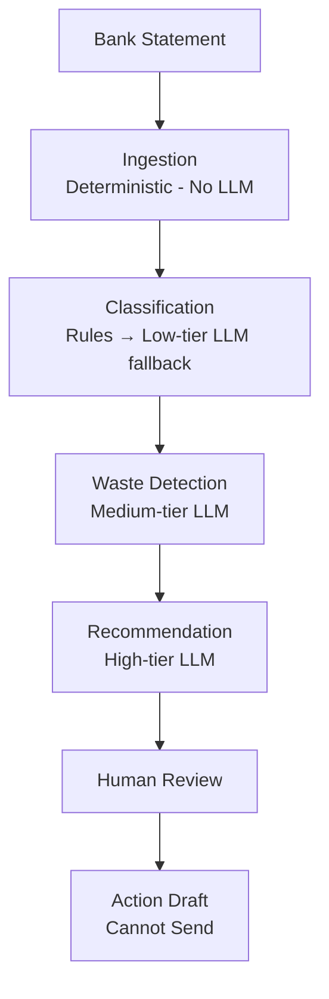

# Spend Guardian

**AI‑powered SaaS subscription waste detection with human‑in‑the‑loop safety.**  
A 5‑agent pipeline that audits bank statements to find duplicate charges, overlapping tools, and unclear ownership — then drafts cancellation/downgrade emails for a human to approve. Never sends an email automatically.

Built for the Kaggle x Google “AI Agents: Intensive Vibe Coding” Capstone — **Agents for Business** track.

---

## The Problem

Businesses lose thousands on forgotten SaaS subscriptions. Tools like Figma, Adobe, Jira, and Asana get bought by different teams and billed to the same credit card without anyone noticing. Bank statements alone contain enough signal to catch duplicate charges and overlapping tools, but manual audits are slow and error‑prone.

---

## The Solution

Spend Guardian is a **multi‑agent pipeline** that:

1. **Ingests** messy bank export files (CSV, JSON, raw text).  
2. **Classifies** each transaction to a vendor and category using deterministic rules, with an LLM fallback for unknown vendors.  
3. **Detects waste** — exact duplicates within 3 days (HIGH confidence), category overlaps (MEDIUM confidence), and named‑seat ownership risks.  
4. **Recommends actions** — “Cancel duplicate,” “Investigate further,” etc. — with potential savings computed from actual amounts, never from the LLM.  
5. **Drafts outreach emails** — but never sends them. A human must approve every draft via the CLI or API.

**All monetary values are calculated in code; every flag requires human review; category overlaps never exceed MEDIUM confidence; and the Action agent has no ability to send anything.**

---

## Architecture



text

The pipeline runs sequentially: **Ingestion → Classification → Waste Detection → Recommendation**. The **Action agent is not automatic** — it’s triggered by a human selecting a specific waste flag.

---

## Safety Guardrails (Hard Rules)

1. Every `WasteFlag` has `requires_human_review = True` — **no exceptions**.
2. Category overlap is capped at `confidence_score = MEDIUM`. Only exact duplicate charges (same vendor, same amount, **within 3 days**) reach `HIGH`.
3. Same vendor/amount **28–31 days apart is a normal monthly recurrence, not a duplicate** — never flagged.
4. The Action agent **only drafts**. It has no send/cancel tool structurally. Only explicit human approval in `api/main.py` or `cli/audit.py` can move a draft to SENT (mocked).
5. No dormancy or usage claims — bank data has no login signal.
6. All monetary totals (`monthly_cost`, `potential_savings`) are computed in code from transaction amounts, never by an LLM.
7. Schema validation at every agent boundary; retry once on malformed output, then hard‑fail.
8. No enrichment, taxonomy, or multi‑source ingestion — these are listed as future work.

An **eval suite** (`eval/run_evals.py`) enforces these rules. Any flag with `requires_human_review=False` or a category overlap marked `HIGH` **fails the eval immediately**.

---

## Course Concepts Demonstrated

| Concept | Implementation |
|---------|---------------|
| **Agent / Multi‑agent system (ADK)** | Five agents defined as `google.adk.Agent` with `FunctionTool`s; ADK orchestrator in `pipeline/adk_orchestrator.py` |
| **Security features** | Card number redaction in ingestion, `requires_human_review=True` everywhere, Action agent structurally blocked from sending |
| **Agent skills (CLI)** | Full CLI (`cli/audit.py`) with `audit`, `list‑flags`, `list‑drafts`, `draft`, and `approve` commands |

---

## Quickstart

### Prerequisites
- Python 3.10+
- Groq API key (free tier works)

### Setup

```bash
git clone https://github.com/Harbinr1/spend-guardian.git
cd spend-guardian
pip install -r requirements.txt
Create a .env file in the project root:

text
GROQ_API_KEY=your_groq_api_key_here
MODEL_LOW=groq/openai/gpt-oss-20b
MODEL_MEDIUM=groq/openai/gpt-oss-20b
MODEL_HIGH=groq/openai/gpt-oss-120b
Run the Full Pipeline (CLI)
bash
python -m cli.audit audit data/sample_transactions.json
This will:

Ingest 12 sample transactions (one malformed — Slack with amount="N/A" — which is skipped with a warning)

Classify vendors

Flag an exact duplicate (AWS, $312.40 billed twice within 3 days) and two category overlaps (Design: Figma+Adobe; Project Management: Jira+Asana)

Produce savings reports with potential savings calculated from actual amounts

Generate a Draft (requires a previous audit)
bash
python -m cli.audit draft exact_dup_AWS_312.4 --recipient finance@acme.com
Approve and Mock‑Send a Draft
bash
python -m cli.audit approve draft_exact_dup_AWS_312.4
The “send” is a mock — it appends a SENT entry to runs/drafts.jsonl and prints the draft to console.

Run with ADK Orchestrator
bash
python -m cli.audit audit data/sample_transactions.json --adk
Same output, but using the ADK‑wrapped agents.

Run the Eval Suite
bash
python -m eval.run_evals
All 7 golden cases should pass (including the normal recurrence exclusion).

API (Optional)
Start the FastAPI server:

bash
uvicorn api.main:app --reload
Then open http://127.0.0.1:8000/docs for interactive Swagger documentation.
Endpoints: POST /audit, GET /flags, GET /drafts, POST /draft, POST /approve.

Repository Structure
text
├── agents/               # Five agents + ADK wrappers + contract docs (*.md)
├── pipeline/             # Orchestrator (original + ADK)
├── mcp/                  # Mock Gmail client + draft store
├── api/                  # FastAPI thin wrapper
├── cli/                  # CLI thin wrapper
├── schemas/              # Pydantic models (locked schema)
├── eval/                 # Golden cases + eval runner
├── data/                 # Sample transactions fixture
├── routing/              # Model tier routing (LOW/MEDIUM/HIGH)
├── sandbox/              # Agent sandbox test runner
├── RUNBOOK.md            # Full build runbook (source of truth for development)
├── AGENTS.md             # Agent contracts and locked file list
└── README.md             # This file
Future Work
data/taxonomy.json — central vendor dictionary

Enrichment agent for monthly cost estimation, department inference

Dormancy / utilization detection (requires login data, not just bank statements)

Multi‑source ingestion (Stripe, Okta)

Real Gmail OAuth integration

Caching, rate limiting, observability

These are explicitly out of scope for the capstone but represent a natural production path.
